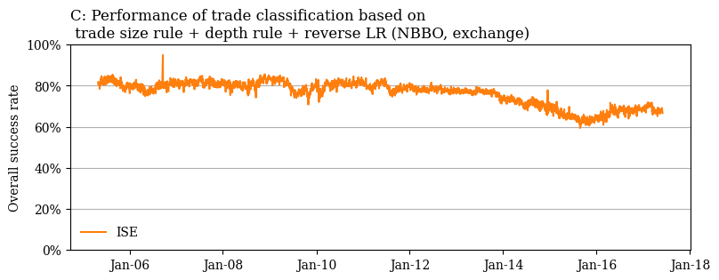

## Define Rules
This tutorial aims to reproduce plots from a working paper by Grauer et. al [^1], which achieves state-of-the-art performance in option trade classification. The authors recommend to classify option trades by:
> [...] our new trade size rule together with quote rules successively applied to NBBO and quotes on the trading venue. Quotes at the midpoint on both the NBBO and the exchange should be classified first with the depth rule and any remaining trades with the reverse tick test.


There's a lot going on.🥵 To match the author's description, we first set up `layers`. We use the subset "ex" to refer to exchange-specific data, "best" to the NBBO and "all" for inter-exchange level data. Identical to the paper we perform random classification on unclassified trades, hence `strategy="random"`.
```python
from tclf.classical_classifier import ClassicalClassifier

layers = [
    ("trade_size", "ex"),
    ("quote", "best"),
    ("quote", "ex"),
    ("depth", "best"),
    ("depth", "ex"),
    ("rev_tick", "all"),
]
clf = ClassicalClassifier(layers=layers, strategy="random")
```

## Prepare Dataset

Next, we load our input data. I store my dataset of ISE trades in a google cloud bucket as `parquet` files and load them into a dataframe `X`.

```python
import gcsfs
import pandas as pd

fs = gcsfs.GCSFileSystem()

gcs_loc = fs.glob(
        "gs://your_bucket/your_dir/*"
)
X = pd.read_parquet(gcs_loc, engine="pyarrow", filesystem=fs)
```

Once the dataset is loaded, we can prepare it  save the true label and the timestamp of the trade to a new dataframe, named `X_meta`, which is required for plotting and remove it from the original dataframe.
```python
features_meta = ["QUOTE_DATETIME", "buy_sell"]
X_meta = X[features_meta]
X = X.drop(columns=features_meta).rename(
    {
        "TRADE_PRICE": "trade_price",
        "TRADE_SIZE": "trade_size",
        "BEST_ASK": "ask_best",
        "BEST_BID": "bid_best",
        "buy_sell": "y_true",
    },
    axis=1,
)
X[["ask_size_best", "bid_size_best"]] = X[["ask_size_ex", "bid_size_ex"]]
```

## Plot Results

To estimate the accuracy over time, we group by date and estimate the accuracy for each group. We make use of [`sklearn.metrics.accuracy_score`](https://scikit-learn.org/stable/modules/generated/sklearn.metrics.accuracy_score.html).

```python
from sklearn.metrics import accuracy_score

df_plot = X_meta.groupby(X_meta.QUOTE_DATETIME.dt.date).apply(
    lambda x: accuracy_score(x["y_true"], x["y_pred"]) * 100
)
```
We use [`matplotlib`](https://matplotlib.org/) to match the plots from the paper as close as possible.


```python
import matplotlib.pyplot as plt
from matplotlib.dates import DateFormatter
from matplotlib.ticker import PercentFormatter

plt.rcParams["font.family"] = "serif"

plt.figure(figsize=(9, 3))
plt.grid(True, axis="y")

# line plot
plt.plot(df_plot, color="tab:orange", linewidth=1.5, label="ISE")

# y-axis + x-axis
plt.ylim(0, 100)
plt.ylabel("Overall success rate")
ax = plt.gca()
ax.yaxis.set_major_formatter(PercentFormatter(100, decimals=0))
ax.xaxis.set_major_formatter(DateFormatter("%b-%y"))

# title + legend
plt.title(
    "C: Performance of trade classification based on\n trade size rule + depth rule + reverse LR (NBBO,exchange)",
    loc="left",
)
plt.legend(loc="lower left", frameon=False)

plt.show()
```

**Output:**



[^1]: <div class="csl-entry">Grauer, C., Schuster, P., &amp; Uhrig-Homburg, M. (2023). <i>Option trade classification</i>. <a href="https://doi.org/10.2139/ssrn.4098475">https://doi.org/10.2139/ssrn.4098475</a></div>
  <span class="Z3988" title="url_ver=Z39.88-2004&amp;ctx_ver=Z39.88-2004&amp;rfr_id=info%3Asid%2Fzotero.org%3A2&amp;rft_val_fmt=info%3Aofi%2Ffmt%3Akev%3Amtx%3Adc&amp;rft.type=document&amp;rft.title=Option%20trade%20classification&amp;rft.aufirst=Caroline&amp;rft.aulast=Grauer&amp;rft.au=Caroline%20Grauer&amp;rft.au=Philipp%20Schuster&amp;rft.au=Marliese%20Uhrig-Homburg&amp;rft.date=2023"></span>
